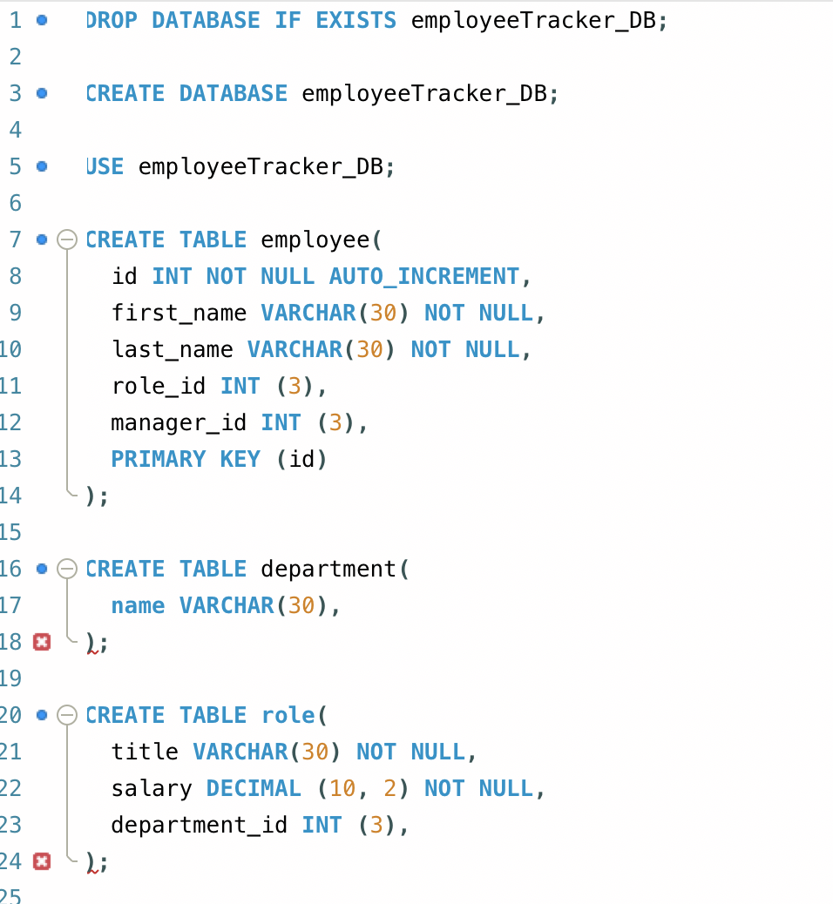
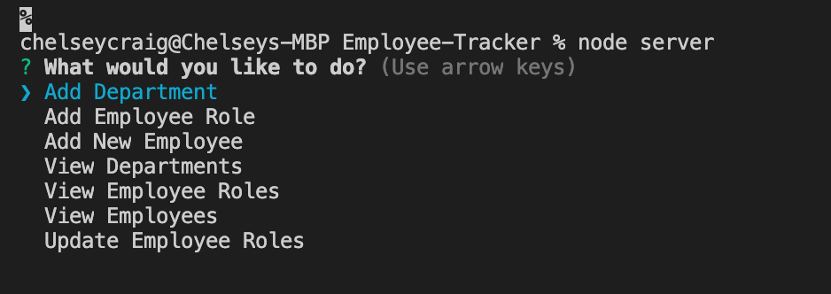
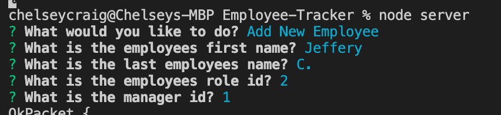
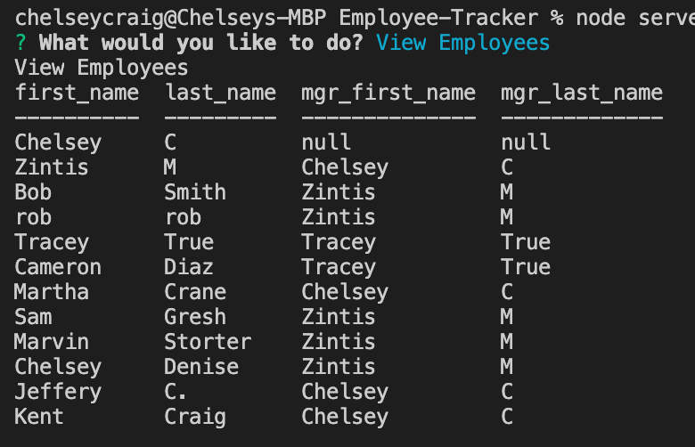
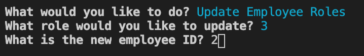

# Employee-Tracker

## Description

This application will allow the user to track employees, roles, and departments within the database. Along with this, the user will also be able to add new employees, new roles, and new departments at his/her descretion.

___

## How it Works

In order for this application to work the user will need to use the terminal to run the program.  The application is linked to MySQL via a query connection that gets the information from the schema page and inputs it into the command line application. 
  

  

In the terminal is where the user will be able to the main menu of the applicaiton. This can be done by runnning "node server" in the command line.
  

  

From there, the user will be able to use the arrow keys to navigate to a new tab. If the user decides to add a new employee, department, or role, he/she will be prompted with a series of questions using the inquirer package through Node.js. This is done by establishing relationships between the tables and implementing mulitple foreign keys within the code.

  

  

After each prompt is completed, the user will be directed back to the main menu in order to continue making new selections within the application. If the user choices to view the departments, employee roles, or all employees, he/she will see a table of all the results wihtin that particular field. This is acheived through the console.table package through node. 
  

  

The final action that can be in this application is the option to change the role of an employee. This is done by changing the role id of the employee to a new id.
  

  

Once this is completed, the user can continue to add and view employee information until their process is completed.
  
___

### Links for Video Guide and GitHubDeployment
 
Video Guie: https://drive.google.com/file/d/1KuuBSc4G3di5bms1ZfgsBLt90uDd9-Sb/view
  
GitHub:  https://ccraig7321.github.io/Employee-Tracker/
  

___

### License

Copyright 2020 CHELSEY CRAIG

Permission is hereby granted, free of charge, to any person obtaining a copy of this software and associated documentation files (the "Software"), to deal in the Software without restriction, including without limitation the rights to use, copy, modify, merge, publish, distribute, sublicense, and/or sell copies of the Software, and to permit persons to whom the Software is furnished to do so, subject to the following conditions:

The above copyright notice and this permission notice shall be included in all copies or substantial portions of the Software.

THE SOFTWARE IS PROVIDED "AS IS", WITHOUT WARRANTY OF ANY KIND, EXPRESS OR IMPLIED, INCLUDING BUT NOT LIMITED TO THE WARRANTIES OF MERCHANTABILITY, FITNESS FOR A PARTICULAR PURPOSE AND NONINFRINGEMENT. IN NO EVENT SHALL THE AUTHORS OR COPYRIGHT HOLDERS BE LIABLE FOR ANY CLAIM, DAMAGES OR OTHER LIABILITY, WHETHER IN AN ACTION OF CONTRACT, TORT OR OTHERWISE, ARISING FROM, OUT OF OR IN CONNECTION WITH THE SOFTWARE OR THE USE OR OTHER DEALINGS IN THE SOFTWARE.

___